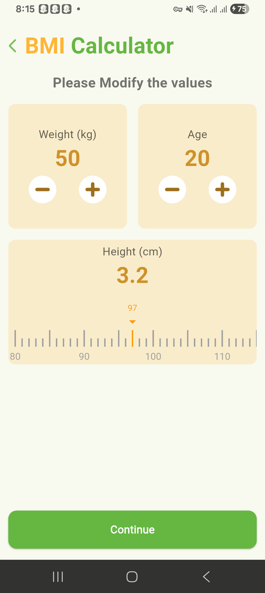
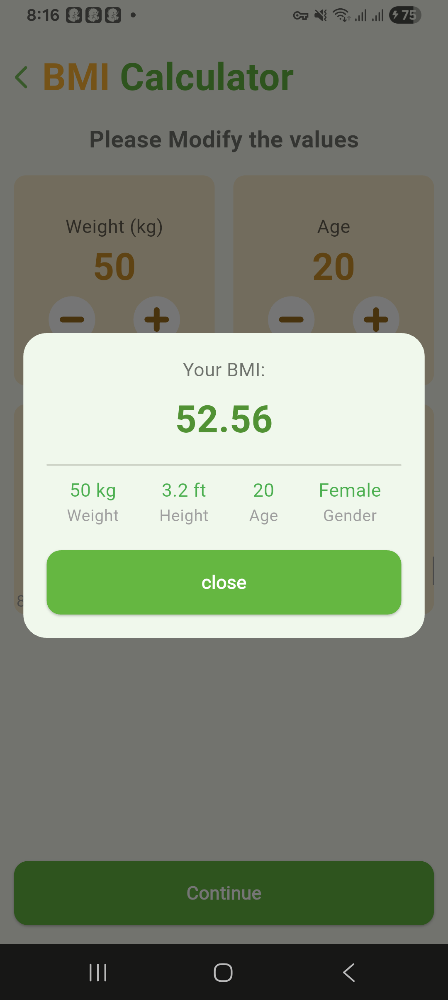

# BMI Calculator

A new Flutter project.

## Getting Started

This project is part of **Assignment 5** from the TuteDude Flutter course.  
**Task: Build an Interactive BMI Calculator**

## Description

This app is a simple BMI calculator:

- On the first screen, users can select their gender.
- After clicking **Continue**, they are taken to the next screen where they can enter their **height, weight, and age**.
- Once they press **Continue**, a dialog box appears showing their calculated BMI result.

## Screenshots

  
  
  
