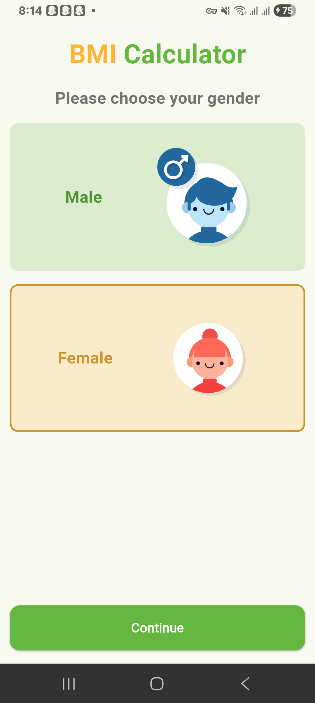

# Mood Swing

A new Flutter project.

## Getting Started

This project is an assignment (Assignment 3) from the TuteDude Flutter course.  
It demonstrates a **creative use of `setState()`** to update the UI dynamically.

## Description

This app shows a **Mood Swing** that displays an **emoji and mood text** from a predefined list of moods stored in a **HashMap (list of maps)**.

The displayed mood is determined by an **index counter**.  
Each time you interact with the app (e.g., pressing buttons), the counter increments, and the app calculates `counter % 4` to cycle through the moods in the list.

This approach ensures the app **loops through the moods continuously**, updating both the **emoji** and the **text description** dynamically using `setState()`.

## Screenshots

